# ditaa-mirror

> ⚠️🏗️🚧🦺🧱🪵🪨🪚🛠️👷
> 
> This is a working draft in progress
> 
> 
> 
> ⚠️🏗️🚧🦺🧱🪵🪨🪚🛠️👷

----

This repo is a mirror version of the original repo project in this link: https://sourceforge.net/p/ditaa/svn/HEAD/tree/

More documentation is on the way... 

----

## The repo project architecture

```mermaid
---
title: "ditaa-mirror repo project"
author: "Cong Le"
version: "1.0"
license(s): "MIT, CC BY-SA 4.0"
copyright: "Copyright (c) 2025 Cong Le. All Rights Reserved."
config:
  layout: elk
  theme: base
---
%%%%%%%% Mermaid version v11.4.1-b.14
%%%%%%%% Available curve styles include the following keywords:
%% basis, bumpX, bumpY, cardinal, catmullRom, linear, monotoneX, monotoneY, natural, step, stepAfter, stepBefore.
%%{
  init: {
    'flowchart': { 'htmlLabels': true, 'curve': 'linear' },
    'fontFamily': 'Andale Mono, monospace',
    'themeVariables': {
      'primaryColor': '#FFFF',
      'primaryTextColor': '#F8B229',
      'lineColor': '#F8B229',
      'primaryBorderColor': '#27AE60',
      'secondaryColor': '#E2F1',
      'secondaryTextColor': '#6C3483',
      'secondaryBorderColor': '#A569BD',
      'fontSize': '20px'
    }
  }
}%%
flowchart TB
    %% UI Layer
    subgraph CLI_Frontend["CLI Frontend"]
    style CLI_Frontend fill:#298F,stroke:#333,stroke-width:1px
    direction TB
        CLC["CommandLineConverter"]:::frontend
        CP["ConfigurationParser"]:::frontend
        CO["ConversionOptions"]:::frontend
    end

    subgraph Web_Frontend["Web Frontend"]
    style Web_Frontend fill:#28F,stroke:#333,stroke-width:1px
    direction TB
        subgraph Controllers["Controllers"]
        style Controllers fill:#FFEF,stroke:#333,stroke-width:1px
            IS["ImageServlet"]:::frontend
            RS["RestartServlet"]:::frontend
            CE["Compare"]:::frontend
        end
        
        subgraph Helpers["Helpers"]
        style Helpers fill:#DDEF,stroke:#333,stroke-width:1px
            ER["ExternalRenderer"]:::service
            HK["HttpKit"]:::service
            IK["IOKit"]:::service
            WC["Config"]:::service
        end
        
        subgraph JSP_HTML_CSS_Views["JSP/HTML/CSS Views"]
        style JSP_HTML_CSS_Views fill:#AAEF,stroke:#333,stroke-width:1px
            JSP1["entry.jsp"]:::view
            JSP2["frames.jsp"]:::view
            HTML["ditaa.html"]:::view
            CSS["ditaa.css"]:::view
            JSP3["timeout.jsp"]:::view
        end
    end

    %% Core Library
    subgraph Core_Library["Core Library"]
    style Core_Library fill:#92D1,stroke:#333,stroke-width:1px
    direction TB
        subgraph Text_Module["Text Module"]
        style Text_Module fill:#DFF2,stroke:#333,stroke-width:1px
        direction TB
            AC["AbstractCell"]:::text
            AG["AbstractionGrid"]:::text
            CS["CellSet"]:::text
            GP["GridPattern"]:::text
            GPG["GridPatternGroup"]:::text
            TG["TextGrid"]:::text
            SU["StringUtils"]:::text
        end
        
        subgraph Graphics_Module["Graphics Module"]
        style Graphics_Module fill:#E2E2,stroke:#333,stroke-width:1px
        direction TB
            D["Diagram"]:::graphics
            DS["DiagramShape"]:::graphics
            CDS["CompositeDiagramShape"]:::graphics
            SVG["OffScreenSVGRenderer"]:::graphics
            BMP["BitmapRenderer"]:::graphics
            CSD["CustomShapeDefinition"]:::graphics
            IH["ImageHandler"]:::graphics
        end
        
        subgraph Utilities["Utilities"]
        style Utilities fill:#AC99,stroke:#333,stroke-width:1px
        direction TB
            FU["FileUtils"]:::util
            DU["DebugUtils"]:::util
            P["Pair"]:::util
        end
    end

    %% Resources and Libraries
    Shapes[("Shape XML Store")]:::resource
    Libs(("Third-Party JARs")):::external

    subgraph Build_and_Deployment["Build & Deployment"]
    style Build_and_Deployment fill:#EC99,stroke:#333,stroke-width:1px
    direction TB
        BX["build.xml"]:::build
        WB["web/build.xml"]:::build
        RX["release.xml"]:::build
        BP["web/build.properties"]:::build
    end

    subgraph Tests["Tests"]
    style Tests fill:#fF21,stroke:#333,stroke-width:1px
    direction TB
        GTest["GridPatternTest"]:::test
        TTest["TextGridTest"]:::test
        VTest["VisualTester"]:::test
        DTest["DitaaTest"]:::test
    end

    %% Connections
    CLC --> CP
    CP --> CO
    CO --> AC
    AC --> AG
    AG --> CS
    CS --> GP
    GP --> GPG
    GPG --> TG
    TG --> D
    D --> DS
    DS --> CDS
    CDS --> SVG
    SVG --> BMP
    CSD --> SVG
    CSD --> BMP
    IH --> BMP
    CO --> SVG
    CO --> BMP

    IS --> ER
    RS --> ER
    CE --> ER
    ER --> CO
    HK --> ER
    IK --> ER
    WC --> ER
    JSP1 --> IS
    JSP2 --> IS
    HTML --> IS
    CSS --> IS
    JSP3 --> IS

    Shapes --> CSD
    Libs --> SVG
    Libs --> BMP
    Libs --> CP

    BX --> CLC
    WB --> IS
    RX --> BX
    BP --> WB

    GTest --> GP
    TTest --> TG
    VTest --> BMP
    DTest --> IS

    %% Click Events
    click CLC "https://github.com/conglesolutionx/ditaa-mirror/blob/main/src/org/stathissideris/ascii2image/core/CommandLineConverter.java"
    click CP "https://github.com/conglesolutionx/ditaa-mirror/blob/main/src/org/stathissideris/ascii2image/core/ConfigurationParser.java"
    click CO "https://github.com/conglesolutionx/ditaa-mirror/blob/main/src/org/stathissideris/ascii2image/core/ConversionOptions.java"
    click AC "https://github.com/conglesolutionx/ditaa-mirror/blob/main/src/org/stathissideris/ascii2image/text/AbstractCell.java"
    click AG "https://github.com/conglesolutionx/ditaa-mirror/blob/main/src/org/stathissideris/ascii2image/text/AbstractionGrid.java"
    click CS "https://github.com/conglesolutionx/ditaa-mirror/blob/main/src/org/stathissideris/ascii2image/text/CellSet.java"
    click GP "https://github.com/conglesolutionx/ditaa-mirror/blob/main/src/org/stathissideris/ascii2image/text/GridPattern.java"
    click GPG "https://github.com/conglesolutionx/ditaa-mirror/blob/main/src/org/stathissideris/ascii2image/text/GridPatternGroup.java"
    click TG "https://github.com/conglesolutionx/ditaa-mirror/blob/main/src/org/stathissideris/ascii2image/text/TextGrid.java"
    click SU "https://github.com/conglesolutionx/ditaa-mirror/blob/main/src/org/stathissideris/ascii2image/text/StringUtils.java"
    click D "https://github.com/conglesolutionx/ditaa-mirror/blob/main/src/org/stathissideris/ascii2image/graphics/Diagram.java"
    click DS "https://github.com/conglesolutionx/ditaa-mirror/blob/main/src/org/stathissideris/ascii2image/graphics/DiagramShape.java"
    click CDS "https://github.com/conglesolutionx/ditaa-mirror/blob/main/src/org/stathissideris/ascii2image/graphics/CompositeDiagramShape.java"
    click SVG "https://github.com/conglesolutionx/ditaa-mirror/blob/main/src/org/stathissideris/ascii2image/graphics/OffScreenSVGRenderer.java"
    click BMP "https://github.com/conglesolutionx/ditaa-mirror/blob/main/src/org/stathissideris/ascii2image/graphics/BitmapRenderer.java"
    click CSD "https://github.com/conglesolutionx/ditaa-mirror/blob/main/src/org/stathissideris/ascii2image/graphics/CustomShapeDefinition.java"
    click IH "https://github.com/conglesolutionx/ditaa-mirror/blob/main/src/org/stathissideris/ascii2image/graphics/ImageHandler.java"
    click FU "https://github.com/conglesolutionx/ditaa-mirror/blob/main/src/org/stathissideris/ascii2image/core/FileUtils.java"
    click DU "https://github.com/conglesolutionx/ditaa-mirror/blob/main/src/org/stathissideris/ascii2image/core/DebugUtils.java"
    click P "https://github.com/conglesolutionx/ditaa-mirror/blob/main/src/org/stathissideris/ascii2image/core/Pair.java"
    click Shapes "https://github.com/conglesolutionx/ditaa-mirror/blob/main/images/shapes/all.xml"
    click Shapes "https://github.com/conglesolutionx/ditaa-mirror/blob/main/images/shapes/all_bw.xml"
    click Shapes "https://github.com/conglesolutionx/ditaa-mirror/blob/main/images/shapes/flowchart/config.xml"
    click Shapes "https://github.com/conglesolutionx/ditaa-mirror/blob/main/images/shapes/networking/config.xml"
    click IS "https://github.com/conglesolutionx/ditaa-mirror/blob/main/web/src/org/ditaa/web/ImageServlet.java"
    click RS "https://github.com/conglesolutionx/ditaa-mirror/blob/main/web/src/org/ditaa/web/RestartServlet.java"
    click CE "https://github.com/conglesolutionx/ditaa-mirror/blob/main/web/src/org/ditaa/web/Compare.java"
    click ER "https://github.com/conglesolutionx/ditaa-mirror/blob/main/web/src/org/ditaa/web/ExternalRenderer.java"
    click HK "https://github.com/conglesolutionx/ditaa-mirror/blob/main/web/src/org/ditaa/web/HttpKit.java"
    click IK "https://github.com/conglesolutionx/ditaa-mirror/blob/main/web/src/org/ditaa/web/IOKit.java"
    click WC "https://github.com/conglesolutionx/ditaa-mirror/blob/main/web/src/org/ditaa/web/Config.java"
    click JSP1 "https://github.com/conglesolutionx/ditaa-mirror/blob/main/web/war/entry.jsp"
    click JSP2 "https://github.com/conglesolutionx/ditaa-mirror/blob/main/web/war/frames.jsp"
    click HTML "https://github.com/conglesolutionx/ditaa-mirror/blob/main/web/war/ditaa.html"
    click CSS "https://github.com/conglesolutionx/ditaa-mirror/blob/main/web/war/ditaa.css"
    click JSP3 "https://github.com/conglesolutionx/ditaa-mirror/blob/main/web/war/timeout.jsp"
    click BX "https://github.com/conglesolutionx/ditaa-mirror/blob/main/build.xml"
    click WB "https://github.com/conglesolutionx/ditaa-mirror/blob/main/web/build.xml"
    click RX "https://github.com/conglesolutionx/ditaa-mirror/blob/main/build/release.xml"
    click BP "https://github.com/conglesolutionx/ditaa-mirror/blob/main/web/build.properties"
    click GTest "https://github.com/conglesolutionx/ditaa-mirror/blob/main/src/org/stathissideris/ascii2image/test/GridPatternTest.java"
    click TTest "https://github.com/conglesolutionx/ditaa-mirror/blob/main/src/org/stathissideris/ascii2image/test/TextGridTest.java"
    click VTest "https://github.com/conglesolutionx/ditaa-mirror/blob/main/src/org/stathissideris/ascii2image/test/VisualTester.java"
    click DTest "https://github.com/conglesolutionx/ditaa-mirror/blob/main/web/src/org/ditaa/web/test/DitaaTest.java"

    %% Styles
    classDef frontend fill:#FFDDAA,stroke:#FF7700
    classDef view fill:#DDEEFF,stroke:#5599FF
    classDef service fill:#EEFFDD,stroke:#77AA00
    classDef text fill:#FFEEDD,stroke:#FFAA00
    classDef graphics fill:#EEDDEE,stroke:#AA00AA
    classDef util fill:#F0F0F0,stroke:#888888
    classDef resource fill:#FFF0AA,stroke:#CCCC00,stroke-dasharray: 2 2
    classDef external fill:#DDDDFF,stroke:#0000AA,stroke-dasharray: 5 5
    classDef build fill:#EEEEDD,stroke:#999900
    classDef test fill:#FFEEEE,stroke:#CC0000
```

------

---

<!-- 

---
>**Licenses:**
>
>- **MIT License:**   - Full text in [LICENSE](LICENSE) file.
>- **Creative Commons Attribution-ShareAlike 4.0 International**: [CC BY-SA 4.0](https://creativecommons.org/licenses/by-sa/4.0/)  - Legal details in [LICENSE-CC-BY-SA-4.0](THE_PAST/LICENSE-CC-BY-SA-4.0) and at [Creative Commons official site](https://creativecommons.org/licenses/by-sa/4.0/).
>
---
